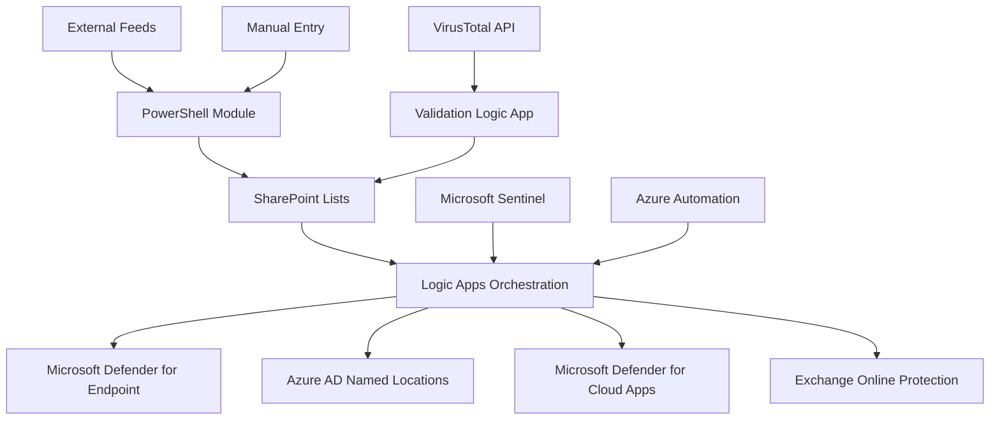

# 🚀 ClarityXDR CTI - Central Threat Intelligence Management Platform

**Transform your security operations with automated threat intelligence deployment across Microsoft 365 E5 ecosystem**

[](https://opensource.org/licenses/MIT)
[](https://www.powershellgallery.com/packages/ClarityXDR-CTI)
[](https://azure.microsoft.com)

> **From Blue to Green in 30 minutes** - Complete threat intelligence automation with one-click deployment

## 🎯 What is ClarityXDR CTI?

ClarityXDR CTI is a comprehensive Central Threat Intelligence management platform that automatically deploys threat indicators across your entire Microsoft 365 E5 security stack. It provides centralized orchestration, automated deployment, and lifecycle management for threat intelligence indicators with built-in validation and false positive handling.

### 🔥 Key Capabilities

**🤖 Automated Deployment Across Platforms**
- **Microsoft Defender for Endpoint** - File hashes, IPs, URLs, domains, certificates
- **Azure AD (Entra ID)** - Named Locations with complete sign-in blocking
- **Microsoft Defender for Cloud Apps** - Risky IP categorization and governance policies  
- **Exchange Online Protection** - Connection filtering and tenant block lists
- **Microsoft Sentinel** - Central orchestration and comprehensive logging

**📊 Intelligent Placement Strategy**
- Context-aware indicator routing (email-related IPs → Exchange, C2 servers → Multi-platform)
- Automatic expiration based on confidence scores
- Smart deployment targeting based on indicator type and threat context

**🔄 Complete Lifecycle Management**
- Real-time validation with VirusTotal and Microsoft Threat Intelligence
- Automated false positive removal across all platforms
- Scheduled cleanup of expired indicators
- Health monitoring and deployment status tracking

**📈 Enterprise-Grade Operations**
- SharePoint-based management interface with approval workflows
- PowerBI-ready data structure for advanced analytics
- Teams/email notifications for critical events
- Comprehensive audit logging and MITRE ATT&CK mapping

## 🚀 Quick Start - Azure Cloud Shell Deployment

### Step 1: App Registration Setup (Foundation)
```bash
# Download and run the app registration script
curl -sL https://raw.githubusercontent.com/ClarityXDR/prod/refs/heads/main/cti/clarityxdr-app-registration.ps1 -o clarityxdr-app-registration.ps1 && pwsh ./clarityxdr-app-registration.ps1 -ResourceGroup "ClarityXDR-RG" -Location "westus"
```

### Step 2: CTI Solution Deployment 
```bash
# Download and run the CTI deployment script
curl -sL https://raw.githubusercontent.com/ClarityXDR/prod/refs/heads/main/cti/deploy-clarityxdr-cti.ps1 -o deploy-clarityxdr-cti.ps1 && pwsh ./deploy-clarityxdr-cti.ps1 -TenantId "YOUR_TENANT_ID" -SubscriptionId "YOUR_SUBSCRIPTION_ID" -ResourceGroupName "ClarityXDR-RG" -SharePointTenantUrl "https://yourdomain-admin.sharepoint.com" -SharePointSiteUrl "https://yourdomain.sharepoint.com/sites/CTI"
```

> **Pro Tip**: Replace `YOUR_TENANT_ID`, `YOUR_SUBSCRIPTION_ID`, and domain URLs with your actual values

## 📋 Prerequisites

| Component | Requirement |
|-----------|-------------|
| **Licenses** | Microsoft 365 E5 or equivalent security suite |
| **Permissions** | Global Administrator + Azure Subscription Owner |
| **PowerShell** | 5.1+ (auto-configured in Cloud Shell) |
| **Time** | ~30 minutes for complete deployment |

### Required Microsoft 365 Components
- ✅ Microsoft Defender for Endpoint P2
- ✅ Microsoft Defender for Office 365 P2  
- ✅ Azure Active Directory P2
- ✅ Microsoft Sentinel
- ✅ SharePoint Online Plan 2
- ✅ Microsoft Defender for Cloud Apps

## 🏗️ Architecture Overview



### Core Components

**🎛️ Orchestration Layer**
- **Logic Apps**: IoC ingestion, validation, deployment, and removal workflows
- **Azure Automation**: Scheduled operations, health monitoring, and maintenance
- **Microsoft Sentinel**: Central logging, KQL queries, and workbook dashboards

**💾 Data Management**
- **SharePoint Lists**: Central indicator repository with approval workflows
- **Custom Log Tables**: CTI_IndicatorManagement_CL, CTI_ValidationResults_CL
- **Configuration Management**: JSON-based configuration with environment support

**🔌 Security Platform Integrations**
- **Microsoft Defender for Endpoint**: Custom detection rules and IoC deployment
- **Azure AD Conditional Access**: Automated Named Location creation with sign-in blocking
- **MDCA Governance**: Risky IP categorization and automated policy creation
- **Exchange Online**: Connection filtering and tenant allow/block list management

## 🎮 Management Interfaces

### 1. PowerShell Module - Developer/Admin Interface
```powershell
# Import and initialize
Import-Module ClarityXDR-CTI
Initialize-CTIModule -SentinelWorkspaceId "YOUR_WORKSPACE_ID"

# Add threat indicators
Set-CTIIndicator -Type "IPAddress" -Value "192.168.1.100" -Confidence 85 -Source "ThreatFeed"

# Bulk operations
Get-CTIIndicators | Where-Object {$_.Confidence -lt 50} | Remove-CTIIndicator

# Deployment status
Get-CTIDeploymentStatus | Format-Table
```

### 2. SharePoint Interface - SOC Analyst Workflow
- **ThreatIndicatorsList**: Primary management interface with rich metadata
- **Approval Workflows**: Built-in review process for high-impact indicators  
- **Action History**: Complete audit trail with automated timestamp logging
- **Deployment Status Tracking**: Real-time visibility into platform deployment

### 3. Microsoft Sentinel - Security Operations Center
- **Custom Workbooks**: CTI dashboard with deployment metrics and health status
- **KQL Query Library**: Pre-built hunting queries and detection rules
- **Automated Alerts**: Failed deployments, quota exceeded, validation failures

## 🔄 Automated Operations

### Daily Scheduled Tasks
```powershell
# Automatically runs via Azure Automation
- Sync pending indicators to all security platforms
- Validate existing deployments across platforms  
- Remove expired indicators with automatic cleanup
- Generate health reports and send notifications
- Update confidence scores based on validation results
```

### Intelligent Placement Examples

| Indicator Type | Context Clues | Deployment Strategy |
|----------------|---------------|-------------------|
| IP Address | "email" in description | → Exchange Connection Filter |
| IP Address | General malicious | → MDCA + Entra ID + MDE |
| URL | "phish" in description | → Exchange Tenant Block List |
| URL | General malicious | → MDE + Exchange |
| File Hash | Any context | → Microsoft Defender for Endpoint |
| Domain | Any context | → MDE + Exchange dual deployment |

## 📊 Key Features Deep Dive

### 🎯 Context-Aware Deployment
The system analyzes indicator descriptions and metadata to determine optimal placement:
- **Email Threats** → Exchange Online Protection (connection filters, tenant block lists)
- **Endpoint Threats** → Microsoft Defender for Endpoint (custom IoCs, detection rules)
- **Identity Threats** → Azure AD Named Locations with complete sign-in blocking
- **Cloud App Threats** → MDCA risky IP categories with governance policies

### 🔍 Validation & Quality Assurance
- **Multi-Source Validation**: VirusTotal, Microsoft Threat Intelligence, custom feeds
- **Confidence Score Updates**: Automatic score adjustment based on validation results
- **False Positive Detection**: Automated removal when indicators fail validation
- **Expiration Management**: Smart TTL based on confidence levels and indicator types

### 🚨 Monitoring & Alerting
- **Real-Time Health Checks**: Platform connectivity and deployment success rates
- **Performance Metrics**: Deployment speed, validation accuracy, false positive rates
- **Threshold Alerts**: Configurable alerts for deployment failures and quota limits
- **Executive Reporting**: Automated daily/weekly summaries for management

## 📈 Integration Examples

### MDCA Risky IP Integration
```powershell
# Automatically creates MDCA policies for malicious IPs
Set-MDCAPolicy -IPAddress "192.168.1.100" -Description "Known C2 server" -Severity "High"
# Result: IP marked as risky category with governance actions applied
```

### Entra ID Named Location with Complete Blocking
```powershell
# Creates Named Location + Conditional Access policy for complete sign-in blocking
Add-EntraNamedLocation -IPAddress "192.168.1.100" -Description "CTI Malicious IP"
# Result: All users blocked from signing in from this IP address
```

### Exchange Online Protection
```powershell
# Adds to connection filter for immediate email blocking
Add-ExchangeConnectionFilterIP -IPAddress "192.168.1.100"
# Result: All email from this IP immediately rejected
```

## 🛠️ Advanced Configuration

### Custom Deployment Strategies
```json
{
  "deploymentStrategies": {
    "high_confidence_ip": {
      "targets": ["MDE", "EntraID", "MDCA", "Exchange"],
      "actions": {
        "EntraID": "complete_block",
        "MDCA": "risky_category",
        "Exchange": "connection_filter"
      }
    }
  }
}
```

### Validation Sources Configuration
```json
{
  "validationSources": [
    {
      "name": "VirusTotal",
      "enabled": true,
      "threshold": 5,
      "weight": 0.7
    },
    {
      "name": "Microsoft Graph Security",
      "enabled": true,
      "weight": 0.3
    }
  ]
}
```

## 📚 File Structure

```
cti/
├── 🚀 deploy-clarityxdr-cti.ps1      # Master deployment script
├── 🔐 clarityxdr-app-registration.ps1 # Foundation app registration
├── 📊 azuredeploy.json                # ARM template for Azure resources
├── 📋 README.md                       # This comprehensive guide
├── 
├── LogicApps/
│   ├── IoC-Ingestion-LogicApp.json   # Indicator intake and processing
│   ├── Validation-LogicApp.json      # Automated validation workflows
│   └── SharePoint-Sync-Orchestrator.json # SharePoint change triggers
├── 
├── PowerShell/
│   ├── CTI-Module.psm1               # Core PowerShell module
│   ├── Add-CTIIndicator.ps1          # Manual indicator addition
│   ├── Get-CTIDeploymentStatus.ps1   # Status monitoring
│   └── Azure-Runbook-CTI-ScheduledOps.ps1 # Daily automation
├── 
├── SharePoint/
│   ├── deploy-soc-template.ps1       # SharePoint site deployment
│   ├── IndicatorListSchema.json      # List structure definition
│   └── kqldashboard.tsx              # Custom SPFx web parts
└── 
└── Templates/
    ├── Azure-Automation-CTI.json     # Automation account template
    └── deployment-config.json        # Environment configuration
```

## 🎯 Use Cases & Benefits

### For Security Operations Centers
- **Reduced Manual Work**: 90% reduction in manual indicator deployment time
- **Centralized Management**: Single interface for all threat intelligence operations  
- **Audit Compliance**: Complete audit trails and automated documentation
- **False Positive Handling**: Automated detection and removal of invalid indicators

### For Enterprise Security Teams
- **Cross-Platform Consistency**: Uniform threat response across all Microsoft 365 services
- **Scalable Operations**: Handle thousands of indicators with automated workflows
- **Threat Intelligence Fusion**: Integrate multiple feeds with smart deduplication
- **Executive Visibility**: Management dashboards and automated reporting

### For Managed Security Service Providers (MSSPs)
- **Multi-Tenant Support**: Separate configurations per customer environment
- **Automated Operations**: Reduce analyst overhead with scheduled maintenance
- **Client Reporting**: Automated weekly/monthly security posture reports
- **Rapid Deployment**: New customer onboarding in under 1 hour

## 🚦 Success Metrics

After deployment, you should see:

| Metric | Target | Benefit |
|--------|--------|---------|
| **Deployment Time** | <2 minutes per indicator | 95% faster than manual deployment |
| **Platform Coverage** | 100% of intended targets | No gaps in security coverage |
| **False Positive Rate** | <5% after validation | Higher quality threat intelligence |
| **Mean Time to Protection** | <5 minutes | Rapid response to emerging threats |

## 🔍 Monitoring & Health Checks

### Built-in Health Monitoring
```powershell
# Automated daily health checks include:
- Logic App execution success rates
- Platform connectivity verification  
- Indicator deployment completion rates
- Validation service availability
- False positive detection rates
```

### Key Performance Indicators (KPIs)
- **Deployment Success Rate**: Target >95% across all platforms
- **Validation Accuracy**: Target >90% correlation with known threat feeds
- **Time to Deployment**: Target <5 minutes from indicator submission
- **False Positive Rate**: Target <5% for validated indicators

## 🆘 Troubleshooting & Support

### Common Issues & Solutions

| Issue | Cause | Solution |
|-------|-------|----------|
| "Insufficient privileges" | Missing admin roles | Ensure Global Admin + Subscription Owner |
| "Logic App timeout" | Large indicator batch | Enable batching in Logic App configuration |
| "SharePoint access denied" | Site permissions | Verify app registration SharePoint permissions |
| "Validation failures" | API quota exceeded | Configure rate limiting in validation Logic App |

### Debug Commands
```powershell
# Test deployment status
Test-CTIDeployment -ResourceGroupName "CTI-RG" -Verbose

# Check service connectivity  
Test-CTIServiceConnectivity

# Validate indicator deployment
Get-CTIIndicator -IndicatorId "xxx" | Test-CTIIndicatorDeployment
```

## 📞 Support & Community

- 🐛 **Bug Reports**: [GitHub Issues](https://github.com/ClarityXDR/prod/issues)
- 💬 **Discussions**: [GitHub Discussions](https://github.com/ClarityXDR/prod/discussions)
- 📖 **Documentation**: [Wiki](https://github.com/ClarityXDR/prod/wiki)
- 💡 **Feature Requests**: [GitHub Issues - Enhancement](https://github.com/ClarityXDR/prod/issues/new?template=feature_request.md)

## 📄 License

This project is licensed under the MIT License - see the [LICENSE](LICENSE) file for details.

## 🏆 Credits

Developed by the ClarityXDR team for the global security community. Built on Microsoft 365 E5 security stack with enterprise-grade automation and monitoring.

---

**Ready to transform your threat intelligence operations?** 

Copy the one-liner commands above into Azure Cloud Shell and go from Blue to Green in 30 minutes! 🚀