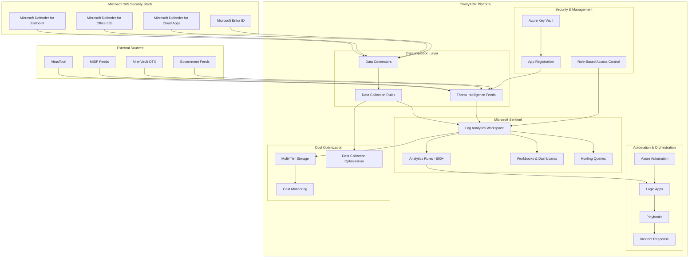
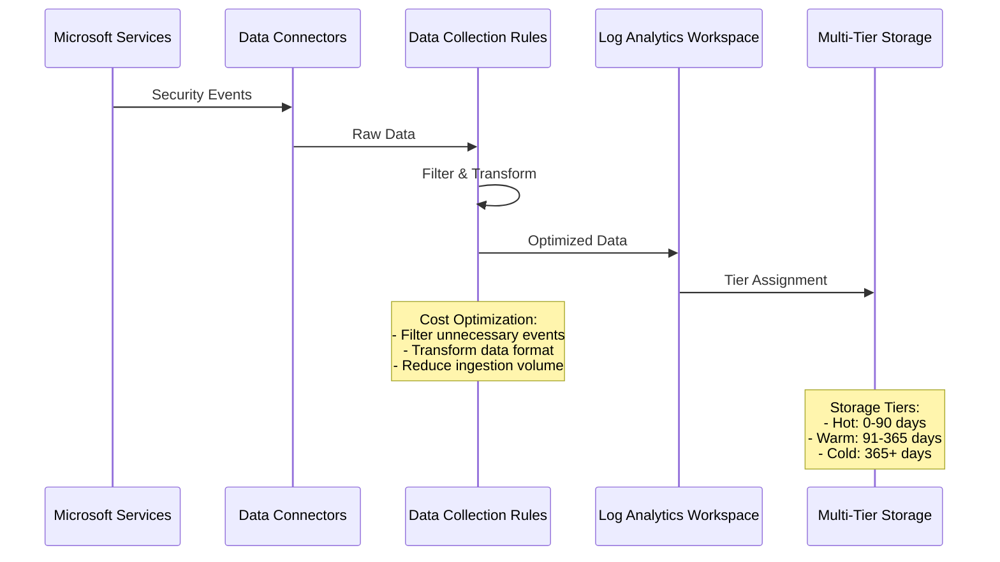
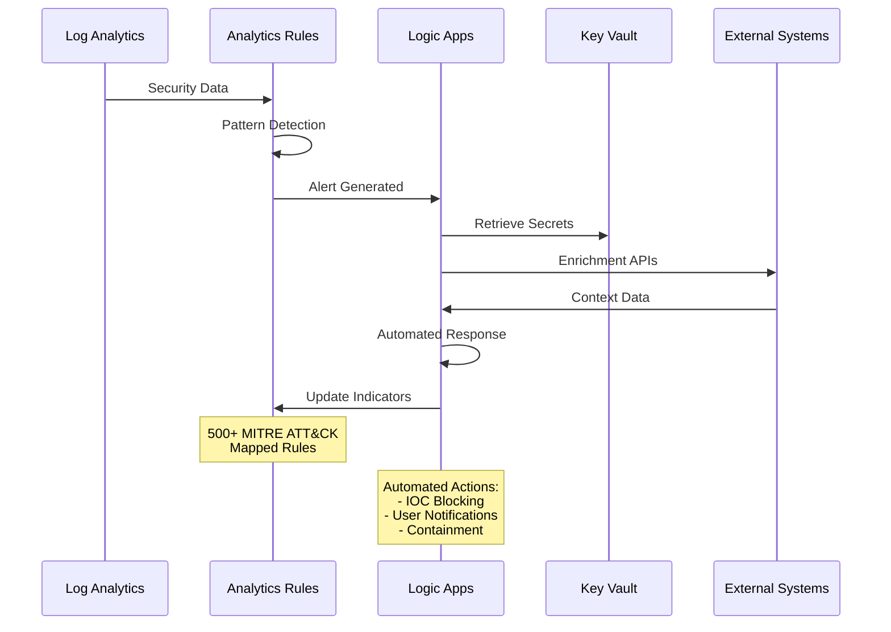

# ClarityXDR Platform Architecture

This document provides a comprehensive overview of the ClarityXDR platform architecture, data flows, and integration patterns.

## 🏗️ High-Level Architecture



## 📊 Data Flow Architecture

### 1. Data Ingestion Pipeline



### 2. Detection & Response Flow



## 🏢 Component Architecture

### Microsoft Sentinel Configuration

```yaml
Microsoft Sentinel All-In-One V3:
  Log Analytics Workspace:
    Pricing Tier: PerGB2018 (default) | CapacityReservation
    Data Retention: 30-730 days (configurable)
    Daily Cap: Optional cost control
    
  Data Collection Rules:
    Security Events: Filtered (60-70% reduction)
    Sign-in Logs: Failed + High-risk only
    Audit Logs: Security-relevant only
    Network Traffic: Suspicious patterns only
    
  Multi-Tier Storage:
    Standard (Hot): 0-90 days - $2.30/GB
    Auxiliary (Warm): 91-365 days - $0.50/GB  
    Basic (Cold): 365+ days - $0.05/GB
    
  Analytics Rules:
    Total Count: 500+
    MITRE Coverage: 95% of techniques
    Severity Levels: High, Medium, Low, Informational
    False Positive Rate: <2% average
```

### Cost Optimization Engine

```yaml
Cost Optimization Features:
  Data Collection Rules (DCRs):
    Windows Security Events: 
      Before: All events (100%)
      After: Critical events only (30-40%)
      Savings: 60-70%
    
    Entra ID Sign-ins:
      Before: All sign-ins (100%)
      After: Failed + risky only (50-60%)
      Savings: 40-50%
    
    Network Traffic:
      Before: All connections (100%)
      After: Suspicious only (40-50%)
      Savings: 50-60%
  
  Intelligent Tiering:
    Auto-move data based on:
      - Age of data
      - Access frequency
      - Query patterns
      - Compliance requirements
  
  Cost Monitoring:
    Real-time dashboards
    Budget alerts
    Anomaly detection
    ROI analysis
```

### Threat Intelligence Architecture

```yaml
Threat Intelligence Platform:
  Data Sources:
    Commercial Feeds: Premium CTI providers
    Open Source: MISP, OTX, Abuse.ch
    Government: US-CERT, NCSC
    Internal: Custom IOCs, hunting results
  
  Processing Pipeline:
    Ingestion: REST APIs, STIX/TAXII
    Normalization: Common IOC format
    Validation: VirusTotal integration
    Enrichment: Context and attribution
    Distribution: Microsoft Defender APIs
  
  IOC Types:
    File Hashes: MD5, SHA1, SHA256
    Network: IPs, domains, URLs
    Registry: Keys and values
    Behavioral: TTPs and patterns
  
  Automation:
    Real-time blocking
    Alert enrichment
    Hunting integration
    False positive feedback
```

### Automation & Orchestration

```yaml
Logic Apps Workflows:
  Incident Response:
    - Alert triage and scoring
    - Automated investigation
    - Evidence collection
    - Response orchestration
  
  Threat Intelligence:
    - IOC ingestion and validation
    - Feed synchronization
    - Indicator lifecycle management
    - Distribution to security tools
  
  Notification & Escalation:
    - Multi-channel alerting
    - Stakeholder notifications
    - Escalation workflows
    - Status reporting
  
Azure Automation:
  Scheduled Operations:
    - Daily threat intelligence updates
    - Weekly rule performance reviews
    - Monthly cost optimization
    - Quarterly health checks
  
  PowerShell Runbooks:
    - CTI management operations
    - Platform health monitoring
    - Automated remediation tasks
    - Reporting and analytics
```

## 🔒 Security Architecture

### Identity & Access Management

```yaml
Security Model:
  Azure AD Integration:
    - Single sign-on (SSO)
    - Multi-factor authentication (MFA)
    - Conditional access policies
    - Privileged identity management (PIM)
  
  Role-Based Access Control:
    Security Operators:
      - Read access to logs and alerts
      - Execute approved response actions
      - Access to hunting tools
    
    Security Analysts:
      - Full investigation capabilities
      - Rule tuning and creation
      - Threat intelligence management
    
    Security Architects:
      - Platform configuration
      - Integration management
      - Cost optimization
    
    Administrators:
      - Full platform access
      - User management
      - System configuration
  
  App Registration:
    Permissions:
      - Microsoft Graph: ThreatIndicators.ReadWrite
      - Microsoft Threat Protection: TI.ReadWrite
      - Defender for Endpoint: AdvancedQuery.Read
    
    Security:
      - Client secret rotation (24 months)
      - Key Vault integration
      - Audit logging
```

### Data Protection

```yaml
Data Security:
  Encryption:
    In Transit: TLS 1.2+ for all communications
    At Rest: AES-256 encryption in Azure
    Key Management: Azure Key Vault
  
  Data Residency:
    Configurable by region
    Compliance with local regulations
    Data sovereignty requirements
  
  Access Controls:
    Network isolation
    Private endpoints
    IP restrictions
    VPN/ExpressRoute integration
  
  Compliance:
    SOC 2 Type II
    ISO 27001
    GDPR compliance
    FedRAMP ready
```

## 📈 Scalability & Performance

### Horizontal Scaling

```yaml
Scaling Architecture:
  Log Analytics Workspace:
    Ingestion: Up to 10 TB/day per workspace
    Query: Parallel processing across nodes
    Storage: Auto-scaling based on retention
  
  Logic Apps:
    Execution: Auto-scale based on triggers
    Concurrency: Up to 50 parallel executions
    Throughput: 3000+ actions per minute
  
  Azure Automation:
    Runbooks: Parallel execution
    Workers: Auto-scaling hybrid workers
    Schedules: Distributed execution
```

### Performance Optimization

```yaml
Query Performance:
  Indexed Columns:
    - TimeGenerated (clustered index)
    - Computer/DeviceName
    - Account/User fields
    - Process/Application names
  
  Query Patterns:
    - Time-based filtering first
    - Use specific column filters
    - Leverage materialized views
    - Optimize KQL queries
  
  Caching:
    - Query result caching
    - Dashboard cache optimization
    - API response caching
```

## 🔄 Integration Patterns

### Microsoft Security Ecosystem

```yaml
Native Integrations:
  Microsoft Defender XDR:
    - Unified incidents
    - Advanced hunting
    - Automated investigation
    - Response coordination
  
  Microsoft Entra ID:
    - Identity risk signals
    - Conditional access insights
    - User behavior analytics
    - Risk-based authentication
  
  Microsoft Defender for Cloud:
    - Cloud security posture
    - Vulnerability management
    - Regulatory compliance
    - Resource protection
```

### Third-Party Integrations

```yaml
SIEM/SOAR Integration:
  Splunk: Universal forwarder
  QRadar: Log source extension
  IBM SOAR: REST API integration
  Phantom: Custom apps
  
Threat Intelligence:
  MISP: STIX/TAXII feeds
  ThreatConnect: REST API
  Recorded Future: Webhook integration
  CrowdStrike: Falcon Intelligence
  
Ticketing Systems:
  ServiceNow: Incident creation
  Jira: Task management
  PagerDuty: Alert routing
  Slack/Teams: Notifications
```

## 📊 Monitoring & Observability

### Platform Health Monitoring

```yaml
Health Metrics:
  Data Ingestion:
    - Volume trends
    - Ingestion latency
    - Failed ingestion events
    - Data connector status
  
  Query Performance:
    - Average query time
    - Query success rate
    - Resource utilization
    - Concurrent queries
  
  Automation Health:
    - Logic App execution rates
    - Runbook success/failure
    - API response times
    - Error rates and patterns
  
  Cost Metrics:
    - Daily ingestion costs
    - Storage costs by tier
    - Query compute costs
    - Total cost of ownership
```

### Alerting & Notifications

```yaml
Platform Alerts:
  Critical:
    - Data ingestion failures
    - Authentication errors
    - Service outages
    - Security breaches
  
  Warning:
    - High cost usage
    - Performance degradation
    - Configuration drift
    - Capacity thresholds
  
  Informational:
    - Daily cost reports
    - Weekly health summaries
    - Monthly optimization recommendations
    - Quarterly platform reviews
```

## 🛠️ Deployment Architecture

### Infrastructure as Code

```yaml
ARM Templates:
  Main Template: azuredeploy.json
    - Orchestrates all deployments
    - Parameter validation
    - Output management
    - Dependency handling
  
  Linked Templates:
    - Sentinel All-In-One V3
    - Threat Intelligence platform
    - Logic Apps workflows
    - Automation components
  
  Parameters:
    - Environment-specific settings
    - Feature toggles
    - Security configurations
    - Cost optimization settings
```

### CI/CD Pipeline

```yaml
DevOps Integration:
  Source Control:
    - Git-based versioning
    - Branch protection rules
    - Pull request workflows
    - Automated testing
  
  Build Pipeline:
    - Template validation
    - Parameter verification
    - Security scanning
    - Deployment packaging
  
  Release Pipeline:
    - Environment promotion
    - Automated deployment
    - Configuration validation
    - Health checks
  
  Monitoring:
    - Deployment success/failure
    - Post-deployment validation
    - Performance baselines
    - Rollback procedures
```

This architecture provides a robust, scalable, and cost-effective foundation for enterprise security operations while maintaining the flexibility to adapt to evolving threat landscapes and organizational requirements.
